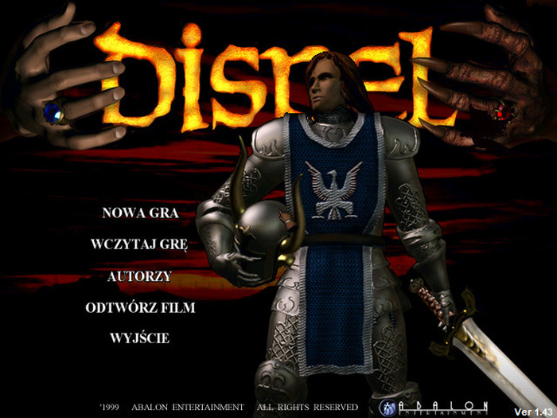
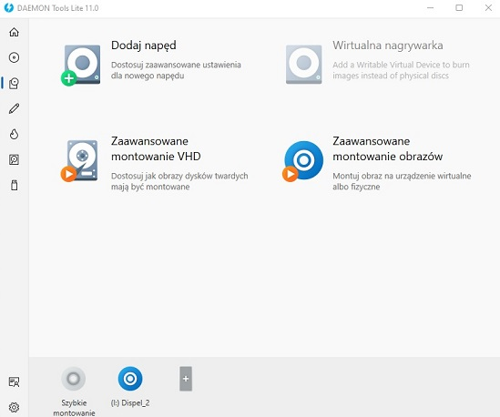
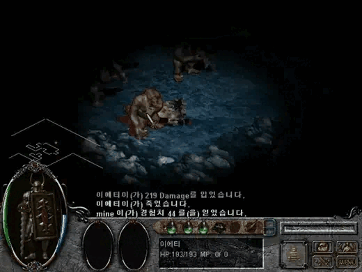

# Dispel (2001) / 디스펠 / Чернокнижник (2000)

No cóż - wielu z Was natknęło się na tę grę w dzieciństwie (z magazynu **PC World Computer**).

Ten klasyczny rpg wydany w 2000 roku... blabla .W menu wita nas od razu kozacki pancerz a intro (jak i cel gry) silnie inspirowane jest naszym wielkim polakiem. Przedstawię tutaj krótki opis instalacji gry oraz instalację patchy **NIEZBĘDNYCH** do jej ukończenia.
## Instalacja gry

Instalujemy grę z CD1 (montując .mdf / .bin / .iso czy cokolwiek znajdziecie online), następnie montujemy CD2 w trybie **CD AUDIO**.
W tym celu można użyć np **DAEMON Tools Lite** (mam flashbacki z dzieciństwa) i zamontować ją z pliku **.cue**
Zamontowanie CD2 w jakimkolwiek innym trybie nie odpali nam muzyki 😔

Osobiście nie mogłem zainstalować gry na Windows 11 (nie odpalał się stary instalator  InstallShield) - polecam postawienie windowsa XP na np. VirtualBox, zainstalowanie gry i po prostu skopiowanie folderu z grą na nasz system.

## Patche

- 1.42

- 1.43

- 1.44

- 1.45 (nieoficjalny)

## Pliki

Wszystkie patche wrzucone są do repo dla potomności - płyty można znaleźć na chomiku lub też wyszukując grę po jej oryginalnej nazwie. 

Pozdrawiam i smacznej kawusi.

